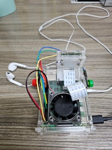
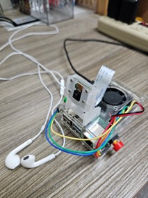

# 邊緣運算導向的AI視覺與語音導盲系統
本專題正在開發邊緣運算導向的可攜式AI視覺與語音導盲系統。於樹莓派佈署多個深度學習模型(YOLO、ResNet-34)，即時辨識行人號誌燈的燈號、斑馬線，並解讀號誌燈秒數，掌握過馬路時機；系統也整合行人偵測與距離計算、語音提示技術，減少過馬路時與行人發生碰撞的風險。協助視障者安全通過馬路。

## 實作過程
<table>
  <tr>
    <td align="center">
       
      裝置範例圖1
    </td>
    <td align="center">
       
      裝置範例圖2
    </td>
  </tr>
</table>

 

### 物件偵測與距離估算結果

  

